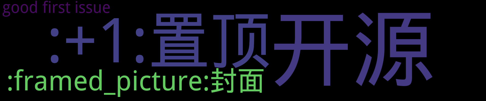

    
    
    
    
    
    
    

    
    

    
## 置顶 :thumbsup: 
- [基于Github Action自动生成并更新GitHub Issue博客的ReadMe](https://github.com/fydy/isblog/issues/6)  0 :speech_balloon:  	 
## 最新 :new: 

#### [isblog](https://github.com/fydy/isblog/issues/8) 0 :speech_balloon: 	 2019-11-28 05:08:01

:label: : [开源](https://github.com/fydy/ghiblog/labels/%E5%BC%80%E6%BA%90)

github issue 自动生成readme.md

[更多>>>](https://github.com/fydy/isblog/issues/8)

---

#### [封面图片](https://github.com/fydy/isblog/issues/7) 3 :speech_balloon: 	 2019-11-28 04:24:38

:label: : [:framed_picture:封面](https://github.com/fydy/ghiblog/labels/%3Aframed_picture%3A%E5%B0%81%E9%9D%A2)

[更多>>>](https://github.com/fydy/isblog/issues/7)

---

#### [基于Github Action自动生成并更新GitHub Issue博客的ReadMe](https://github.com/fydy/isblog/issues/6) 0 :speech_balloon: 	 2019-11-28 04:21:15

:label: : [:+1:置顶](https://github.com/fydy/ghiblog/labels/%3A%2B1%3A%E7%BD%AE%E9%A1%B6), [good first issue](https://github.com/fydy/ghiblog/labels/good%20first%20issue)

基于Github Action自动生成并更新GitHub Issue博客的ReadMe

[更多>>>](https://github.com/fydy/isblog/issues/6)

---

## 分类  :card_file_box: 

    

        
        
:cloud: 词云 :cloud: 点击词云展开详细分类:point_down: 

    

:+1:置顶	1:newspaper:

- [基于Github Action自动生成并更新GitHub Issue博客的ReadMe](https://github.com/fydy/isblog/issues/6)  0 :speech_balloon:  	 

:framed_picture:封面	1:newspaper:

- [封面图片](https://github.com/fydy/isblog/issues/7)  3 :speech_balloon:  	 

good first issue	1:newspaper:

- [基于Github Action自动生成并更新GitHub Issue博客的ReadMe](https://github.com/fydy/isblog/issues/6)  0 :speech_balloon:  	 

开源	1:newspaper:

- [isblog](https://github.com/fydy/isblog/issues/8)  0 :speech_balloon:  	 

    

# 开源项目

| [isblog](https://github.com/fydy/isblog) | github issue 自动生成readme.md
 |    |
| --- | --- | --- |

